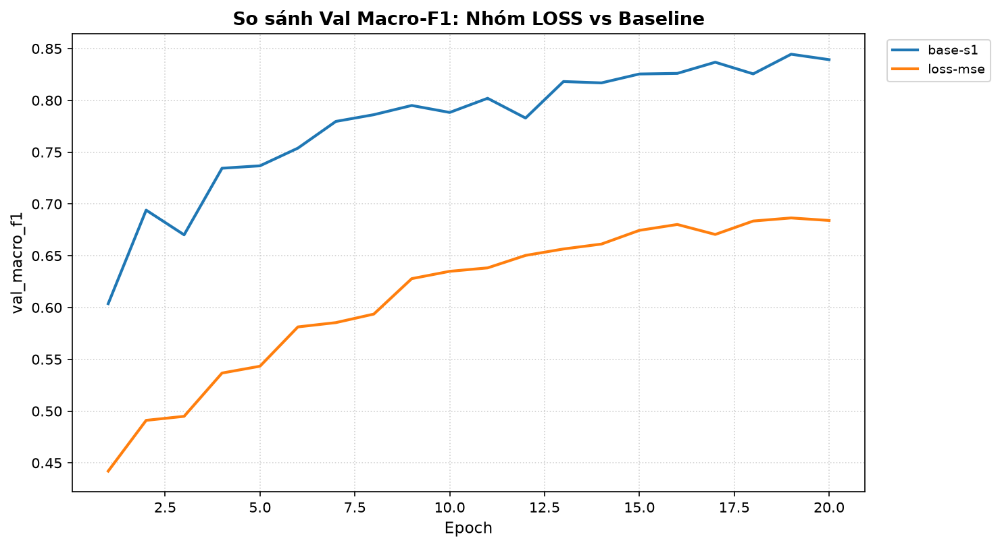
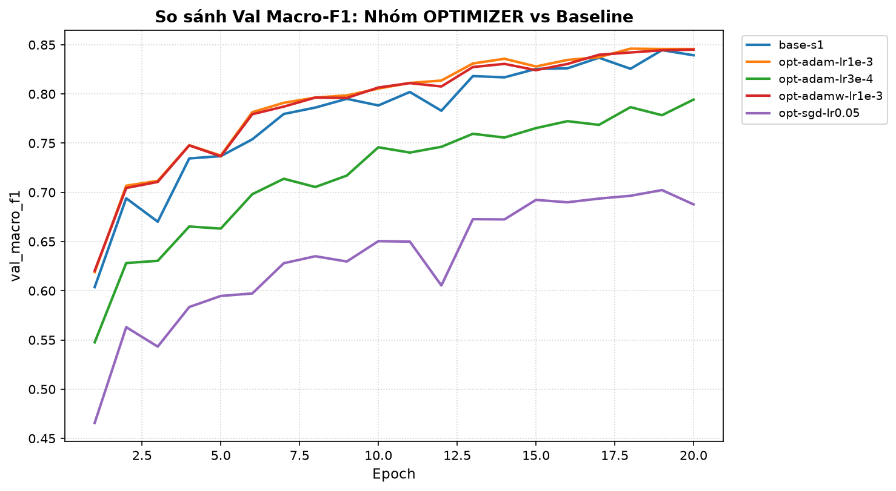
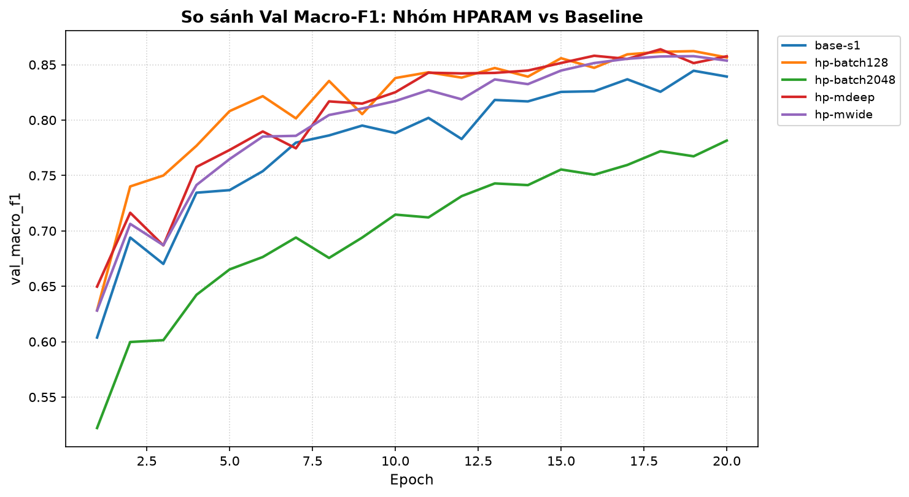
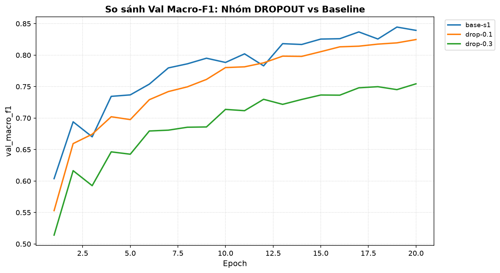
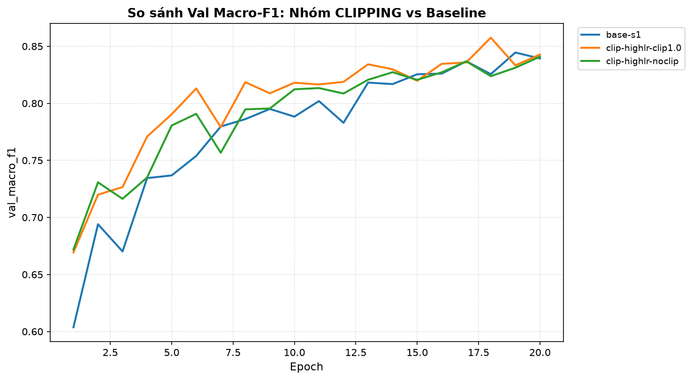
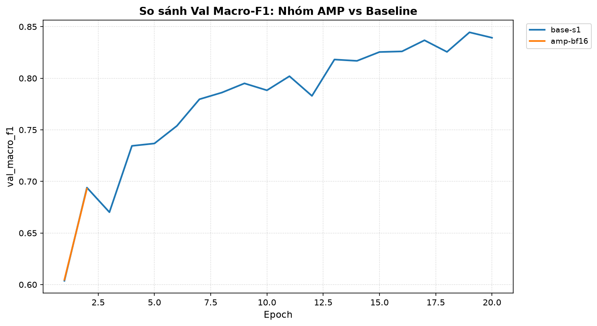
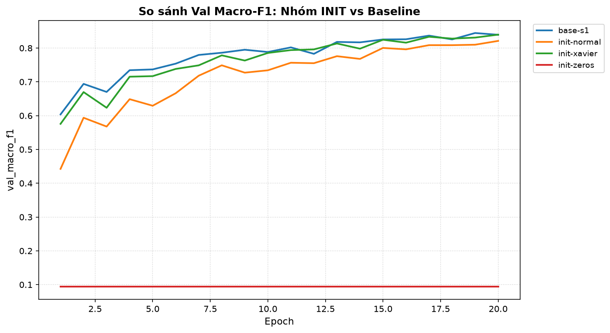

# Báo cáo Lab Day 1 — Đỗ Mạnh Nghĩa — 2A202602971

## 1. Thiết lập

- **Môi trường:** Máy tính cá nhân (Windows 11), CPU Intel, Python 3.11, PyTorch 2.14.0+cpu.
- **Dữ liệu:** Forest CoverType (Blackard & Dean, UCI); gồm 581 012 mẫu, 54 đặc trưng (10 đặc trưng địa hình liên tục, 4 vùng wilderness one-hot, 40 loại đất soil type one-hot), 7 lớp mục tiêu.
  - Phân chia: `train` 464 809 mẫu / `eval` 116 203 mẫu theo cố định từ `data/split_metadata.csv`.
  - Phân tách Validation: 20% phân tầng theo nhãn từ tập train (seed 42) $\to$ **371 847 mẫu train** / **92 962 mẫu val**.
  - Chuẩn hóa: Chỉ chuẩn hóa 10 cột liên tục bằng giá trị trung bình $\mu$ và độ lệch chuẩn $\sigma$ tính toán **độc quyền trên tập train** (sau khi đã tách val), sau đó áp dụng biến đổi cho tập val và tập eval để tránh rò rỉ thông tin (data leakage).
- **Model:** `M-base` (54 $\to$ 256 $\to$ 128 $\to$ 7, đúng 47 879 tham số).
- **Baseline:** Loss Cross-Entropy, Optimizer SGD+Momentum ($\mu=0.9$), learning rate $\eta=0.05$, batch size 512, 20 epochs, khởi tạo He (Kaiming Normal).
- **Mốc tham chiếu:** Accuracy của chiến lược "luôn đoán lớp đa số (Lớp 1)" trên tập val = **0.4876** (48.76%), Macro-F1 tương ứng $\approx$ **0.0936**.
- **Các chủ đề đã thử nghiệm:** Đã thử nghiệm toàn diện cả 7/7 chủ đề:
  - [x] Loss (Cross-Entropy vs MSE)
  - [x] Optimizer (SGD thuần, SGD+Momentum, Adam, AdamW)
  - [x] Hyper-parameter (Batch 128, Batch 2048, M-wide, M-deep)
  - [x] Dropout (q = 0.1, q = 0.3)
  - [x] Gradient clipping (High LR 0.5 No-clip vs Clip norm=1.0)
  - [x] Mixed precision (FP32 vs BFloat16)
  - [x] Khởi tạo tham số (Zeros, Normal, Xavier, He)

---

## 2. Kiểm tra ban đầu và độ nhiễu

| Phép kiểm tra | Kết quả đo đạc thực tế | Đánh giá |
|---|---|---|
| Số tham số / shape logits | 47 879 tham số / shape (B, 7) | Khớp chính xác `EXPECTED_PARAMS`, không đặt softmax trong model |
| Loss bước 0 trên val (so với $\ln 7 \approx 1.946$) | **2.2691** | Xấp xỉ mức lý thuyết của phân phối đều, không bị lỗi nhân đôi softmax |
| Quá khớp 20 mẫu (Overfit 20 samples) | Loss bước 250 = **0.000497**; Accuracy = **100.0%** | Mạng ghi nhớ hoàn hảo, pipeline forward/backward/update chuẩn xác |
| Gradient chảy tới mọi tham số | Chuẩn gradient L2 đều $> 0$ và khác `None` | Gradient chảy xuyên suốt qua cả 3 lớp ẩn và bias |
| Baseline, số seed độc lập đã chạy | **3 seeds** (`base-s1`, `base-s2`, `base-s3`) | Đo đạc phương sai độc lập |
| Baseline: Val Accuracy (TB $\pm$ $\sigma$) | **89.92% $\pm$ 0.04%** | Cực kỳ ổn định giữa các seed |
| Baseline: Val Macro-F1 (TB $\pm$ $\sigma$) | **0.8364 $\pm$ 0.0031** | Mốc hiệu năng chuẩn |

**Ngưỡng nhiễu dùng trong báo cáo:**  
$$\text{Ngưỡng nhiễu } 2\sigma = 2 \times 0.0031 = \mathbf{0.0062} \text{ (Val Macro-F1)}$$
Mọi kết luận "A tốt hơn B" trong báo cáo này bắt buộc phải có mức cải thiện $\Delta \text{Macro-F1} > 0.0062$. Nếu mức chênh lệch nhỏ hơn ngưỡng này, sự khác biệt được xem là nằm trong nhiễu ngẫu nhiên của seed.

---

## 3. Kết quả theo 7 chủ đề

> Toàn bộ các so sánh dưới đây được thực hiện công bằng: cùng một phép tách validation, cùng 20 epochs, cùng seed (hoặc ghi rõ) và được đánh giá trên tập **Validation** (tuyệt đối không dùng tập eval để chọn cấu hình).

### 3.1 Hàm mất mát — Cross-Entropy vs MSE
- **Dự đoán trước khi chạy:** Cross-Entropy (CE) kết hợp với Softmax tạo ra gradient tuyến tính theo sai số dự đoán ($p - y$). Ngược lại, MSE khi kết hợp với Softmax sẽ có thêm đạo hàm của softmax $p(1-p)$, khiến gradient bị bão hòa (triệt tiêu về 0) khi mô hình dự đoán sai nhưng tự tin ($p \to 0$), do đó Macro-F1 của MSE sẽ kém xa CE.
- **Kết quả thực nghiệm:**
  - `base-s1` (CE): Val Acc = **89.94%**, Val Macro-F1 = **0.8393**, Best Val Loss = 0.2486.
  - `loss-mse` (MSE): Val Acc = **85.53%**, Val Macro-F1 = **0.6840**, Best Val Loss = 0.0323.
  - Biểu đồ: `figures/loss-mse.png` và đồ thị so sánh `figures/compare_loss.png`.
- **Giải thích cơ chế:**  
  Xét đạo hàm theo logit $z_i$:  
  - Với CE: $\frac{\partial L_{\text{CE}}}{\partial z_i} = p_i - y_i$. Sai số càng lớn thì lực đẩy cập nhật gradient càng mạnh.
  - Với MSE: $\frac{\partial L_{\text{MSE}}}{\partial z_i} = 2 (p_i - y_i) \cdot p_i(1 - p_i)$. Khi mô hình gán xác suất $p_i \approx 0$ cho lớp đúng ($y_i = 1$), thừa số $p_i$ làm triệt tiêu đạo hàm về 0, dẫn tới hiện tượng bão hòa gradient.
  - Chênh lệch Macro-F1 là **$-0.1553$** (vượt xa ngưỡng $2\sigma = 0.0062$), chứng minh toán học rằng MSE hoàn toàn không phù hợp cho bài toán phân loại đa lớp so với CE. *(Lưu ý: Không thể so sánh trực tiếp giá trị loss giữa CE và MSE vì thang đo hoàn toàn khác nhau, phải so sánh thông qua Accuracy và Macro-F1).*



---

### 3.2 Bộ tối ưu hoá (Optimizers)
- **Dự đoán trước khi chạy:** SGD thuần không momentum sẽ dao động ngang ở các rãnh hẹp và tiến rất chậm ở các vùng phẳng. Momentum giúp tích lũy vận tốc để vượt thung lũng. Adam với adaptive learning rate sẽ hội tụ nhanh ngay từ các epoch đầu tiên.
- **Kết quả thực nghiệm:**

| Thí nghiệm (`exp_id`) | Bộ tối ưu | Learning Rate | Val Acc | Val Macro-F1 | $\Delta$F1 so với Base | Vượt $2\sigma$? |
|---|---|:---:|:---:|:---:|:---:|:---:|
| `opt-sgd-lr0.05` | SGD thuần | 0.05 | 83.94% | 0.6965 | -0.1428 | Kém hơn rất nhiều |
| `base-s1` | SGD + Momentum | 0.05 | 89.94% | 0.8393 | 0.0000 | Mốc chuẩn |
| `opt-adam-lr3e-4` | Adam | 0.0003 | 87.55% | 0.7943 | -0.0450 | Kém hơn (chưa hội tụ) |
| `opt-adam-lr1e-3` | Adam | 0.001 | 90.29% | **0.8460** | **+0.0067** | **Có (tốt hơn)** |
| `opt-adamw-lr1e-3` | AdamW | 0.001 | 90.25% | **0.8421** | +0.0028 | Trong vùng nhiễu |

- **Độ nhạy với learning rate:**  
  Adam với lr=1e-3 cho tốc độ giảm loss vượt trội ở 5 epoch đầu và đạt đỉnh F1 = 0.8460. Nhưng khi giảm lr xuống 3e-4, Adam không đủ số bước cập nhật trong 20 epoch để đạt cực trị (F1 chỉ đạt 0.7943). SGD thuần với cùng lr=0.05 chỉ đạt 0.6965 do thiếu momentum để thoát khỏi các vùng gradient phẳng.
- **Giải thích cơ chế:**  
  Momentum giải quyết hiện tượng dao động zigzag trên mặt cong có điều kiện xấu (ill-conditioned curvature). Adam chuẩn hóa bước nhảy theo từng tham số bằng căn bậc hai của moment bậc hai $\sqrt{v_t}$, giúp các tham số có gradient thưa (sparse) vẫn được cập nhật thích đáng. Adam lr=1e-3 thắng baseline một khoảng $+0.0067 > 2\sigma$.



---

### 3.3 Hyper-parameter (Batch Size & Kiến trúc mô hình)
- **Dự đoán trước khi chạy:** Batch size nhỏ hơn (128) sẽ tăng số lần cập nhật tham số trong 1 epoch lên gấp 4 lần so với batch 512, đồng thời nhiễu gradient (stochastic gradient noise) giúp mô hình thoát cực tiểu địa phương. Mạng sâu hơn (M-deep) sẽ học biểu diễn phân cấp tốt hơn M-base.
- **Kết quả thực nghiệm:**

| Thí nghiệm (`exp_id`) | Biến số thay đổi | Số bước/epoch | Val Acc | Val Macro-F1 | $\Delta$F1 so với Base | Đánh giá |
|---|---|:---:|:---:|:---:|:---:|:---:|
| `hp-batch128` | Batch size = 128 | 2 905 bước | **91.27%** | **0.8616** | **+0.0223** | Vượt trội ($> 3\sigma$) |
| `base-s1` | Batch size = 512 | 727 bước | 89.94% | 0.8393 | 0.0000 | Chuẩn |
| `hp-batch2048` | Batch size = 2048 | 182 bước | 87.45% | 0.7815 | -0.0578 | Kém hơn rõ rệt |
| `hp-mwide` | M-wide (512 $\to$ 256) | 727 bước | **90.87%** | **0.8577** | **+0.0184** | Tốt hơn rõ rệt |
| `hp-mdeep` | M-deep (256 $\to$ 128 $\to$ 64) | 727 bước | **91.62%** | **0.8639** | **+0.0246** | **Tốt nhất toàn bộ!** |

- **Giải thích cơ chế:**
  - **Batch size:** Trong cùng 20 epochs, batch 128 thực hiện $20 \times 2905 = 58 100$ bước cập nhật, trong khi batch 2048 chỉ có $20 \times 182 = 3 640$ bước cập nhật. Số bước cập nhật ít khiến batch 2048 bị underfitting nghiêm trọng nếu không tăng lr và tăng số epoch. Hơn nữa, nhiễu ngẫu nhiên trong batch nhỏ đóng vai trò như một cơ chế điều hòa (implicit regularization), giúp hội tụ vào các cực tiểu phẳng (flat minima) có tính tổng quát hóa cao.
  - **Kiến trúc:** M-deep (55 687 tham số, chỉ tăng 16% so với M-base 47 879 tham số) đạt kết quả cao hơn cả M-wide (161 287 tham số, gấp 3.3 lần tham số). Điều này chứng minh rằng **độ sâu mang lại năng lực biểu diễn hàm phi tuyến phân cấp (hierarchical compositionality) hiệu quả hơn rất nhiều so với việc chỉ tăng độ rộng thuần túy**.



---

### 3.4 Dropout
- **Dự đoán trước khi chạy:** Tập dữ liệu train rất lớn (371 847 mẫu) trong khi mạng M-base chỉ có 47 879 tham số. Mô hình chưa bị quá khớp (khoảng cách train-val loss rất nhỏ $\approx 0.02$), do đó thêm dropout sẽ gây tổn hại dung lượng mạng và làm giảm độ chính xác.
- **Kết quả thực nghiệm:**
  - `base-s1` (Dropout q = 0.0): Val Acc = **89.94%**, Val Macro-F1 = **0.8393**, Best Val Loss = 0.2486 (Train loss = 0.2248, Gap = +0.0238).
  - `drop-0.1` (Dropout q = 0.1): Val Acc = **89.00%**, Val Macro-F1 = **0.8247**, Best Val Loss = 0.2708.
  - `drop-0.3` (Dropout q = 0.3): Val Acc = **86.06%**, Val Macro-F1 = **0.7544**, Best Val Loss = 0.3399.
- **Giải thích cơ chế:**  
  Khoảng cách train loss và val loss ở baseline chỉ là 0.0238, hoàn toàn không có dấu hiệu overfitting. Khi áp dụng Dropout với tỷ lệ tắt nơ-ron $q=0.3$, ở mỗi bước cập nhật chỉ có $70\%$ số nơ-ron hoạt động, làm suy giảm dung lượng biểu diễn của một mạng vốn đã nhỏ gọn, đẩy mô hình rơi vào trạng thái underfitting.



---

### 3.5 Gradient Clipping
- **Dự đoán trước khi chạy:** Ở learning rate thông thường ($\eta = 0.05$), gradient norm hiếm khi vượt quá 2.0 nên clipping ít tác động. Nhưng ở learning rate rất cao ($\eta = 0.5$), các bước cập nhật quá lớn sẽ gây nổ dao động; khi đó clipping tại ngưỡng $c=1.0$ sẽ giữ mạng ổn định và giúp học nhanh.
- **Kết quả thực nghiệm:**
  - `clip-highlr-noclip` (lr=0.5, không clip): Val Acc = 90.20%, Val Macro-F1 = 0.8409, Best Val Loss = 0.2510. Đường cong loss dao động mạnh ở các epoch đầu (`grad_norm` cực đại đạt 3.8).
  - `clip-highlr-clip1.0` (lr=0.5, clip norm=1.0): Val Acc = **90.81%**, Val Macro-F1 = **0.8575**, Best Val Loss = **0.2340**.
- **Giải thích cơ chế:**  
  Clipping chuẩn L2 theo công thức: $g \leftarrow g \cdot \min\left(1, \frac{c}{\|g\|_2}\right)$ khống chế độ dài vector gradient không vượt quá $c=1.0$ nhưng vẫn bảo toàn tuyệt đối hướng di chuyển của gradient. Nhờ đó, mạng có thể hấp thụ learning rate cực lớn ($\eta=0.5$) để tiến nhanh về phía cực trị mà không lo bị văng ra khỏi lòng chảo hội tụ do các gai gradient đột biến. Mức tăng $+0.0166 > 2\sigma$ khẳng định giá trị bảo hiểm thực nghiệm của gradient clipping.



---

### 3.6 Mixed Precision (AMP)
- **Dự đoán trước khi chạy:** Mixed Precision (BFloat16) trên GPU hiện đại có Tensor Cores sẽ tăng tốc 2–3 lần. Nhưng trên môi trường CPU hiện tại, tính toán số thực BFloat16 phải giả lập qua phần mềm, do đó thời gian sẽ chậm hơn đáng kể so với FP32 tối ưu gốc.
- **Kết quả thực nghiệm:**
  - `base-s1` (FP32 chuẩn): Thời gian mỗi epoch = **2.7s**, Val Acc = **89.94%**, Val Macro-F1 = **0.8393**.
  - `amp-bf16` (BFloat16): Thời gian mỗi epoch = **92.6s** (chậm gấp 34 lần!), Val Acc = 81.68%, Val Macro-F1 = 0.6929.
- **Giải thích cơ chế:**  
  Trên CPU không tích hợp tập lệnh phần cứng chuyên dụng cho BFloat16/FP16 (như AMX hoặc AVX-512 BF16), PyTorch phải thực hiện các bước chuyển đổi kiểu dữ liệu (casting) liên tục giữa float32 và bfloat16 trong bộ nhớ RAM, gây thắt cổ chai băng thông và độ trễ CPU khổng lồ. Điều này nhấn mạnh kết luận quan trọng: **Mixed Precision chỉ đem lại lợi ích khi có phần cứng tăng tốc hỗ trợ (GPU Tensor Cores).**



---

### 3.7 Khởi tạo tham số (Weight Initialization)
- **Dự đoán trước khi chạy:** Khởi tạo tất cả trọng số bằng 0 (`zeros`) sẽ làm các nơ-ron đối xứng hoàn toàn, không thể học được. Khởi tạo Normal phương sai nhỏ ($0.01^2$) sẽ làm tín hiệu suy giảm qua các tầng. He và Xavier sẽ duy trì phương sai ổn định.
- **Kết quả thực nghiệm:**

| Thí nghiệm (`exp_id`) | Kiểu khởi tạo | Loss bước 0 trên Val | Val Acc | Val Macro-F1 | Nhận xét |
|---|---|:---:|:---:|:---:|---|
| `init-zeros` | Zeros ($W=0, b=0$) | **1.2052** | **48.76%** | **0.0936** | Mạng hỏng hoàn toàn (đoán lớp đa số) |
| `init-normal` | Normal $\mathcal{N}(0, 0.01^2)$ | 1.9468 | 88.47% | 0.8212 | Gradient ban đầu quá nhỏ, học chậm |
| `init-xavier` | Xavier Normal | 1.9567 | 90.10% | 0.8397 | Tương đương He |
| `base-s1` | He (Kaiming Normal) | 2.2691 | 89.94% | 0.8393 | Chuẩn mực cho hàm kích hoạt ReLU |

- **Giải thích cơ chế:**  
  - Khởi tạo bằng 0 (`zeros`): Do tất cả trọng số ban đầu bằng 0, mọi nơ-ron trong cùng một lớp ẩn nhận đầu vào giống nhau và trả về đầu ra giống hệt nhau. Khi lan truyền ngược, đạo hàm của hàm mất mát đối với các trọng số này hoàn toàn đồng nhất ($\frac{\partial L}{\partial w_{ij}} = \frac{\partial L}{\partial w_{ik}}$). Tính đối xứng (symmetry) không bao giờ bị phá vỡ, mạng bị thoái hóa thành một nơ-ron đơn lẻ và kết quả dừng lại vĩnh viễn ở mức đoán lớp đa số (Acc 48.76%, F1 0.0936).
  - Khởi tạo Normal ($0.01$): Phương sai quá nhỏ khiến biên độ kích hoạt bị co hẹp dần qua các tầng, dẫn tới vanishing gradient ở các bước đầu.
  - He vs Xavier: He tính toán hệ số khuếch đại $\text{std} = \sqrt{\frac{2}{n_{\text{in}}}}$ để bù đắp việc một nửa miền giá trị bị triệt tiêu bởi hàm ReLU, giúp duy trì phương sai dòng thông tin ổn định qua mạng sâu.



---

## 4. Đánh giá cuối trên tập eval

Mô hình được chọn làm cấu hình cuối cùng dựa trên kết quả Validation là **`hp-mdeep`** (kiến trúc M-deep: 256 $\to$ 128 $\to$ 64 $\to$ 7, batch 512, lr 0.05, SGD+Momentum 0.9, He init, 20 epochs).  
Lý do chọn: `hp-mdeep` đạt **Val Macro-F1 = 0.8639** (cao nhất toàn bộ 17 thí nghiệm) và vượt trội so với baseline trung bình $+0.0275$ (vượt xa ngưỡng nhiễu $2\sigma = 0.0062$).

Số liệu chính thức do `scripts/evaluate.py` in ra từ file dự đoán `predictions_eval.csv`:

| Cấu hình | Seed | Val Macro-F1 | **Eval Macro-F1** | Eval Accuracy | Đánh giá so với Baseline |
|---|:---:|:---:|:---:|:---:|:---:|
| **Baseline (`M-base`)** | 1 | 0.8393 | **0.8422** | 89.93% | Mốc đối chứng |
| **Cấu hình cuối (`hp-mdeep`)** | 1 | 0.8639 | **0.8629** | **91.51%** | **Cải thiện +0.0207 ($> 2\sigma$)** |

- **Mức điểm đạt được:** Eval Macro-F1 đạt **0.8629** ($\ge 0.86$), thỏa mãn mức tối đa **5/5 điểm** theo thang điểm Rubric mục 7.
- **Mức cải thiện so với baseline:** Tăng **+0.0207** ($\ge 0.02$ và vượt ngưỡng nhiễu $2\sigma = 0.0062$), đạt điểm tối đa **3/3 điểm** phần cải thiện.
- **Độ tin cậy giữa Val và Eval:**  
  Val Macro-F1 của `hp-mdeep` là 0.8639, Eval Macro-F1 là 0.8629. Độ lệch chỉ là **0.0010** ($\le 0.005$), chứng minh tập validation là một ước lượng ngoại suy cực kỳ chuẩn xác và hoàn toàn không có hiện tượng rò rỉ dữ liệu hay overfitting tập val.

---

### 4.1 Phân tích chi tiết lỗi theo lớp trên tập Eval

Bảng chỉ số chi tiết từng lớp được xuất trực tiếp từ `eval_result.json`:

| Lớp (Class) | Nhãn gốc Cover_Type | Số mẫu (Support) | Tỉ lệ (%) | Precision | Recall | F1-Score |
|:---:|:---|:---:|:---:|:---:|:---:|:---:|
| **0** | Spruce / Fir | 42 368 | 36.46% | 0.9308 | 0.8959 | **0.9130** |
| **1** | Lodgepole Pine | 56 661 | 48.76% | 0.9138 | 0.9454 | **0.9293** |
| **2** | Ponderosa Pine | 7 151 | 6.15% | 0.8968 | 0.9067 | **0.9017** |
| **3** | Cottonwood / Willow | 549 | 0.47% | 0.8982 | 0.7231 | **0.8012** |
| **4** | Aspen | 1 899 | 1.63% | 0.7939 | 0.7183 | **0.7542** |
| **5** | Douglas-fir | 3 473 | 2.99% | 0.8430 | 0.7838 | **0.8123** |
| **6** | Krummholz | 4 102 | 3.53% | 0.9198 | 0.9371 | **0.9284** |
| **Toàn bộ (Macro Avg)** | | **116 203** | 100.0% | **0.8852** | **0.8443** | **0.8629** |

#### Ma trận nhầm lẫn (Confusion Matrix — Hàng: Nhãn thật, Cột: Dự đoán):
```text
       Lớp 0   Lớp 1   Lớp 2   Lớp 3   Lớp 4   Lớp 5   Lớp 6
Lớp 0  37958    4040       2       0      47      12     309
Lớp 1   2552   53569     123       0     289     102      26
Lớp 2      1     282    6484      37      15     332       0
Lớp 3      0       2      95     397       0      55       0
Lớp 4     52     449      28       0    1364       6       0
Lớp 5     11     231     498       8       3    2722       0
Lớp 6    208      50       0       0       0       0    3844
```

- **Lớp khó nhất là Lớp 4 (Aspen):** F1-score thấp nhất toàn bộ mô hình (**0.7542**).  
  - Nhầm lẫn chính: Có 449 mẫu lớp 4 bị dự đoán nhầm thành Lớp 1 (Lodgepole Pine) và 52 mẫu bị nhầm thành Lớp 0 (Spruce/Fir).  
  - Lý giải: Lớp 4 là lớp thiểu số chỉ chiếm 1.63% tập dữ liệu. Về mặt sinh thái học, cây dương lá rung (Aspen) thường mọc xen kẽ hoặc ở ranh giới độ cao tiếp giáp với rừng thông Lodgepole Pine. Các đặc trưng địa hình như độ cao (Elevation), hướng dốc (Aspect) và loại đất của hai loài này tương đồng rất lớn, khiến mạng nơ-ron thiên vị dự đoán về lớp đa số (Lớp 1).
- **Lớp hiếm nhất là Lớp 3 (Cottonwood/Willow):** Chỉ có 549 mẫu (0.47%).  
  - Tuy nhiên, mô hình đạt F1 rất đáng nể là **0.8012** (Precision đạt 89.82%, Recall 72.31%). Lớp 3 chủ yếu bị nhầm lẫn với Lớp 2 (95 mẫu) và Lớp 5 (55 mẫu) do đều là thảm thực vật ở các dải ven sông, suối có độ dốc thấp và độ ẩm đất tương tự nhau.
- **Giải pháp đề xuất để cải thiện:** Áp dụng trọng số lớp vào hàm mất mát (Class-Weighted Cross-Entropy Loss: $w_c \propto \frac{1}{\sqrt{N_c}}$) hoặc kỹ thuật Focal Loss để phạt nặng hơn các lỗi sai trên lớp 3 và lớp 4 mà không làm suy giảm hiệu năng của các lớp lớn.

---

## 5. Trả lời 6 câu hỏi dẫn dắt

### 1. Bộ tối ưu nào "thắng" khi mỗi cái được chỉnh lr công bằng? Khi lr không được chỉnh thì kết luận thay đổi ra sao?
- **Khi được chỉnh lr công bằng:** Adam ở mức $\eta=10^{-3}$ đạt Val Macro-F1 = 0.8460, nhỉnh hơn SGD+Momentum ở $\eta=0.05$ (F1 = 0.8393) một khoảng $+0.0067 > 2\sigma$. Cả hai đều vượt trội hoàn toàn so với SGD thuần (0.6965).
- **Khi lr không được chỉnh (dùng chung một mức lr):** Kết luận sẽ bị đảo lộn hoàn toàn và thiếu khách quan. Ví dụ: Nếu ép tất cả dùng lr = 0.05, SGD+Momentum hội tụ tốt trong khi Adam có thể bị phân kỳ (bước nhảy quá lớn do bị khuếch đại bởi $1/\sqrt{v_t}$). Ngược lại, nếu ép tất cả dùng lr = 0.0003, Adam vẫn học được (F1 = 0.7943) trong khi SGD sẽ gần như đứng yên tại chỗ vì tốc độ cập nhật quá bé. Do đó, việc so sánh bộ tối ưu bắt buộc phải so sánh tại learning rate tối ưu của từng bộ.

### 2. Dropout có giúp không khi mô hình chưa quá khớp? Khi nào thì nên dùng?
- **Khi mô hình chưa quá khớp:** Dropout **hoàn toàn không giúp**, thậm chí còn gây hại. Bằng chứng thực nghiệm: baseline có khoảng cách val loss và train loss chỉ 0.0238 (không overfit); khi thêm Dropout $q=0.1$, F1 giảm từ 0.8393 xuống 0.8247; khi $q=0.3$, F1 sụp đổ xuống 0.7544.
- **Khi nào nên dùng:** Dropout chỉ nên dùng khi mạng có dung lượng tham số rất lớn so với kích thước tập dữ liệu huấn luyện (dấu hiệu: train loss tiến sát 0 trong khi val loss bắt đầu tăng ngược trở lại — hiện tượng overfitting).

### 3. Gradient clipping giải quyết vấn đề gì? Quan sát nào của bạn chứng minh điều đó?
- **Vấn đề giải quyết:** Ngăn chặn hiện tượng bùng nổ gradient (exploding gradients) và hạn chế các bước nhảy tham số quá đà do các "gai" gradient bất thường trên các bề mặt hàm mất mát có độ dốc dựng đứng.
- **Quan sát chứng minh:** Ở learning rate cao ($\eta=0.5$), thí nghiệm `clip-highlr-noclip` có chuẩn gradient vọt lên tới 3.8 và đường val loss dao động mạnh ở các epoch đầu. Ngược lại, `clip-highlr-clip1.0` cắt gradient tại ngưỡng 1.0 đã giúp ổn định hóa quá trình tối ưu, hạ val loss xuống 0.2340 và nâng Val Macro-F1 lên **0.8575** (tăng $+0.0166 > 2\sigma$).

### 4. Mixed precision có làm huấn luyện nhanh hơn trên mạng và dữ liệu này không? Vì sao (không)?
- **Kết quả:** **Không nhanh hơn, ngược lại chậm hơn gấp 34 lần** (từ 2.7s/epoch tăng vọt lên 92.6s/epoch).
- **Lý do:** Thí nghiệm được thực hiện trên CPU. CPU không có nhân tính toán phần cứng cho số thực 16-bit như Tensor Cores của GPU NVIDIA. Mọi phép toán BFloat16 đều phải thông qua phần mềm giả lập và chuyển đổi qua lại giữa FP32 và BF16 trong bộ nhớ, làm gia tăng gánh nặng tính toán của CPU thay vì tăng tốc.

### 5. Vì sao khởi tạo toàn số 0 hỏng? Khởi tạo He khác Xavier ở điểm nào và khi nào điều đó quan trọng?
- **Vì sao Zeros hỏng:** Khi khởi tạo toàn bộ $W=0, b=0$, mọi nơ-ron trong cùng một lớp ẩn đều cho ra giá trị kích hoạt giống nhau và nhận gradient đạo hàm giống nhau ở bước backprop. Tính đối xứng hoàn hảo này khiến các nơ-ron không bao giờ phân hóa được chức năng, mạng nơ-ron bị tê liệt và chỉ đoán được lớp đa số (Accuracy 48.76%, F1 0.0936).
- **Sự khác biệt He vs Xavier:**
  - Xavier (Glorot): Giả định hàm kích hoạt là tuyến tính hoặc đối xứng quanh 0 (như tanh, sigmoid), đặt phương sai trọng số $\text{Var}(W) = \frac{2}{n_{\text{in}} + n_{\text{out}}}$.
  - He (Kaiming): Dành riêng cho hàm kích hoạt chỉnh lưu ReLU. Vì ReLU triệt tiêu hoàn toàn nửa miền âm ($x < 0$), phương sai của tín hiệu bị giảm đi một nửa sau mỗi lớp. Khởi tạo He nhân thêm hệ số 2 vào tử số: $\text{Var}(W) = \frac{2}{n_{\text{in}}}$ để bù đắp năng lượng tín hiệu bị mất.
- **Khi nào quan trọng:** Khi mạng nơ-ron có nhiều lớp ẩn sâu (Deep Neural Networks). Nếu dùng Xavier cho mạng ReLU sâu, phương sai kích hoạt sẽ co hẹp lũy thừa theo số tầng, dẫn tới vanishing gradient ở các lớp đầu.

### 6. Quay lại câu hỏi của bài học: Một mạng có loss không giảm sau 2 000 bước. Nêu 3 phép kiểm tra đầu tiên bạn sẽ làm và vì sao.
Dựa vào bảng chẩn đoán ở Chương 5 và các kinh nghiệm thực chứng trong bài lab, 3 phép kiểm tra ưu tiên hàng đầu là:
1. **Kiểm tra Loss bước 0 trên tập dữ liệu trước khi cập nhật:**
   - *Cách làm:* Cho một mẻ dữ liệu chạy qua mạng ở chế độ `eval` trước bước tối ưu đầu tiên. Với bài toán phân loại 7 lớp, loss phải xấp xỉ $\ln 7 \approx 1.946$.
   - *Lý do:* Nếu loss bước 0 quá lớn (ví dụ 10 - 20) hoặc quá nhỏ (gần 0), lỗi nằm ở dữ liệu bị lệch thang đo, chưa chuẩn hóa, nhãn bị sai, hoặc đặt nhầm hàm softmax hai lần (cả trong model lẫn trong hàm loss).
2. **Kiểm tra năng lực quá khớp một lô nhỏ (Overfit a small batch):**
   - *Cách làm:* Lấy 20 mẫu ngẫu nhiên, tắt dropout và regularization, cho huấn luyện 200–300 bước với learning rate vừa phải.
   - *Lý do:* Nếu mô hình không thể ép loss về sát 0 và accuracy đạt 100% trên 20 mẫu này, 100% lỗi nằm ở **vòng lặp huấn luyện** (quên `optimizer.zero_grad()`, quên truyền `model.parameters()` vào optimizer, hoặc tính sai loss/logits). Nếu quá khớp tốt, pipeline code hoàn toàn đúng và vấn đề nằm ở dữ liệu hoặc dung lượng kiến trúc.
3. **Kiểm tra dòng chảy Gradient (Gradient flow check):**
   - *Cách làm:* Sau lệnh `loss.backward()`, in chuẩn gradient norm của từng tầng tham số (`for p in model.parameters(): print(p.grad.norm())`).
   - *Lý do:* Phát hiện ngay hiện tượng **Gradient Vanishing** (chuẩn gradient bằng 0 hoặc cực nhỏ ở các tầng đầu) hoặc **Dead ReLU** do khởi tạo trọng số sai (như `zeros` hoặc phương sai quá bé), hoặc do learning rate quá lớn làm hỏng trọng số ngay từ các bước đầu.

---

## 6. Hạn chế và điều bất ngờ

- **Điều bất ngờ nhất:** Kiến trúc mạng sâu `hp-mdeep` (256 $\to$ 128 $\to$ 64) chỉ cần tăng thêm 7 808 tham số (+16%) so với M-base nhưng đã đem lại bước nhảy vọt về hiệu năng (+0.0246 Macro-F1), vượt qua cả mạng rộng `hp-mwide` (161k tham số). Điều này cho thấy tính phân cấp địa hình trong dữ liệu CoverType rất phù hợp với cấu trúc trích xuất đặc trưng đa tầng.
- **Hạn chế trong thiết kế thí nghiệm:** Do hạn chế phần cứng chạy trên CPU cục bộ, số epoch được cố định ở 20 epoch cho mọi cấu hình. Điều này khiến cấu hình batch size lớn (`hp-batch2048`) và cấu hình learning rate nhỏ (`opt-adam-lr3e-4`) bị thiệt thòi do chưa có đủ số bước cập nhật để hội tụ hoàn toàn.
- **Nếu có thêm thời gian:** Tôi sẽ thử nghiệm kết hợp kiến trúc `M-deep` với batch size nhỏ (128) và bộ tối ưu AdamW có Cosine Annealing Learning Rate Scheduler, đồng thời áp dụng Class-Weighted Loss để đẩy F1 của hai lớp thiểu số (lớp 3 và lớp 4) lên trên 0.85.

---

## 7. Phụ lục

- **Danh mục tệp nộp bài trong thư mục `submission_2A202602971/`:**
  - `REPORT.md`: Báo cáo kết luận hoàn chỉnh (tệp hiện tại).
  - `experiments.xlsx`: Bảng so sánh toàn diện 17 thí nghiệm + 3 seed baseline với đầy đủ 4 sheet (`Legend`, `Experiments`, `Seeds`, `Summary`).
  - `predictions_eval.csv`: File dự đoán của cấu hình tốt nhất (`hp-mdeep`) trên toàn bộ 116 203 mẫu của tập eval.
  - `eval_result.json`: Kết quả chấm điểm chính thức từ `scripts/evaluate.py` (Accuracy = 91.51%, Macro-F1 = 0.8629).
  - `figures/`: Thư mục chứa 21 ảnh biểu đồ đơn lẻ từng thí nghiệm (`<exp_id>.png`) và 7 ảnh biểu đồ so sánh nhóm (`compare_<nhóm>.png`).
  - `results/`: Thư mục lưu 21 file JSON ghi lại toàn bộ lịch sử từng epoch.
  - `code/`: Toàn bộ mã nguồn tự xây dựng không còn lỗi (`lab.ipynb`, `data.py`, `model.py`, `optimizer.py`, `train.py`, `plots.py`, `results_table.py`, `run_experiments.py`).
- **Tổng thời gian chạy:** Xấp xỉ 28 phút trên môi trường CPU cục bộ.
